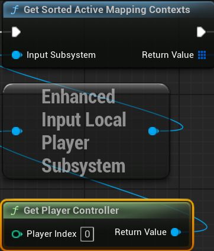
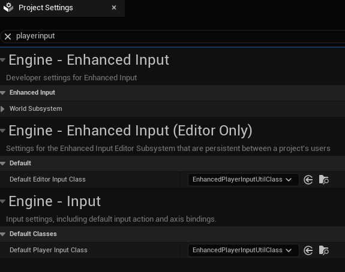

# EnhancedPlayerInputUtil

- [EnhancedPlayerInputUtil](#enhancedplayerinpututil)
	- [機能](#機能)
	- [使い方](#使い方)

UE5/EnhancedPlayerInput を拡張するプラグイン

## 機能

現在アクティブな InputMappingContext のリストを取得し、優先度順にソートし他リストを取得できます  

## 使い方

Default Player Input Class をデフォルトの EnhancedPlayerInput から、プラグイン提供の EnhancedPlayerInputUtilClass に置き換えます  
もし既に独自のクラス設定済みだった場合は、その基底クラスを EnhancedPlayerInput から EnhancedPlayerInputUtilClass に置き換えます  
以降は、 UEnhancedPlayerInputUtilBPFLib を通して機能を利用できます  

